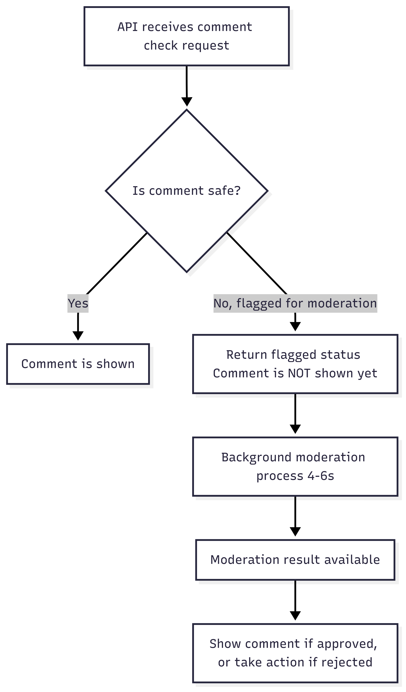
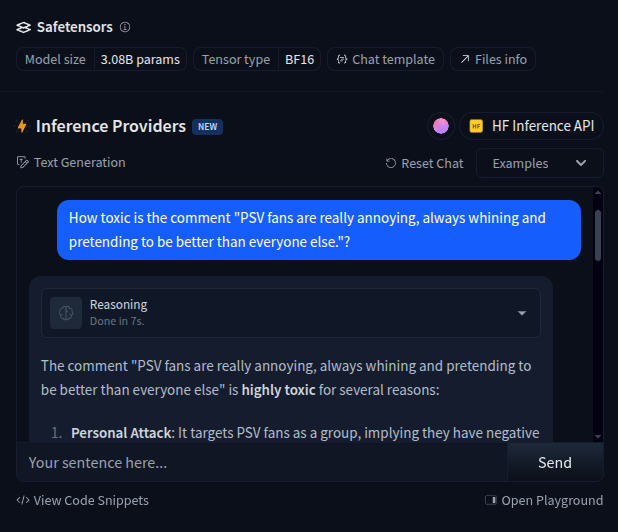

# Dutch Comments Checker

Attempts to demonstrate how we can do "Cheap-First, Smart-Later" on LLM based projects.
That is, to avoid using LLM as much as possible, by supplementing them with their cheaper, faster counterparts: Transformers.

Everything here can run locally, but in production, ideally the transformers are either shipped with the app on a FastAPI project or hosted in huggingface, then the LLM (ollama with llama3 in here) can be something like OpenAI's API.

The idea is a REST based API that other projects can connect to like e-Commerce products, blog articles with comments, etc and give a fast, AI powered but sub second moderation capability (less than 200ms). The slower LLM based moderation would only really kick in if the comments are actually deemed toxic or spam.

# API Request Flow



This project is used for studying so this won't be as polished as actual moderation tools.

Uses a prebuilt pytorch 2.7.1. 
Without the prebuilds, `pip install --no-cache-dir -r requirements.txt` will probably run for more than an hour. I stopped trying at 1hr 40 minutes so I'm unsure if it would take more than 2. I just rebuilt the *.whl files from an existing venv i have locally and ran `pip wheel torch -w ~/torch-wheel`. The contents of that is what you see on `prebuilds` folder.


## Instructions

Build and run with with
```
make build && make models
```

Build will take a long time, about 20-30+ minutes.
- Build mostly takes time when downloading and building torch and downloading NVIDIA libraries (hence why i put volumes on docker compose just for caching them). Would take about `[+] Building 3240.0s (16/16) FINISHED` in my case.
- Downloading the models for the classifiers takes another 5 or so minutes.


Once built and models downloaded, run the thing:
```
make run
```

Make run will also take a while to run if this is your first time running an ollama and you don't have `llama3` locally yet. `ollama_entrypoint.sh` is set to download `llama3` in this phase.

It'll seem "done" right away, but check with:

```
make logs
```

and it should say something like:

```
dcc_ollama   | pulling 6a0746a1ec1a:    8%
```

You should be able to make the API work at this point but it won't do llm based analysis until `llama3` is available.

### Could not select driver

`make run` fails with error:

```
> make run
docker: Error response from daemon: could not select device driver "" with capabilities: [[gpu]]
```

### 1. Add NVIDIA package repositories
```
sudo apt update
sudo apt install -y curl gnupg ca-certificates
```

```
sudo mkdir -p /etc/apt/keyrings
```
```
curl -fsSL https://nvidia.github.io/libnvidia-container/gpgkey | \
  sudo gpg --dearmor -o /etc/apt/keyrings/nvidia-container-toolkit.gpg
```

```
curl -s -L https://nvidia.github.io/libnvidia-container/stable/deb/nvidia-container-toolkit.list | \
  sed 's#deb #deb [signed-by=/etc/apt/keyrings/nvidia-container-toolkit.gpg] #' | \
  sudo tee /etc/apt/sources.list.d/nvidia-container-toolkit.list
```

```
sudo apt update
sudo apt install -y nvidia-container-toolkit
```

### Update Docker so it can run the thing with a GPU

```
sudo nvidia-ctk runtime configure --runtime=docker
sudo systemctl restart docker
```

## Database Migrations

To create a new Alembic migration with a custom message, use:

```
make migrate-revise "Your migration message here"
```

This will pass the message to Alembic and generate a migration file with your description.


## Major TODOs

- Moderation UUID for comments flagged for moderation. This is so we have an easy way for clients to asynchronously check moderation results
- Instead of `llama3`, maybe something like [HuggingFaceTB/SmolLM3-3B](https://huggingface.co/HuggingFaceTB/SmolLM3-3B) is good enough for what we're doing. Or maybe find a dutch specific. But the thing works just fine, just need some more testing I think:



## Developer Notes

**Testing**
After sending several comments to it, use the query to check them all:
```
SELECT 
	comments.id,
	cmr.recommended_action,
    cmr.confidence,
	-- subjects.text,
    -- comments.context,
    comments.text,
    -- ctr.text_translation,
    cmr.reasoning,
    scc.spam,
    scc.ham,
    tcc.toxic,
    tcc.insult,
    tcc.obscene,
    tcc.identity_hate,
    tcc.severe_toxic,
    tcc.threat
FROM comments
LEFT JOIN comment_moderation_results AS cmr ON cmr.comment_id = comments.id
LEFT JOIN subjects ON subjects.id = comments.subject_id
LEFT JOIN comment_translation_results AS ctr ON ctr.comment_id = comments.id
LEFT JOIN spam_comment_classifications AS scc ON scc.comment_id = comments.id
LEFT JOIN toxic_comment_classifications AS tcc ON tcc.comment_id = comments.id
```

